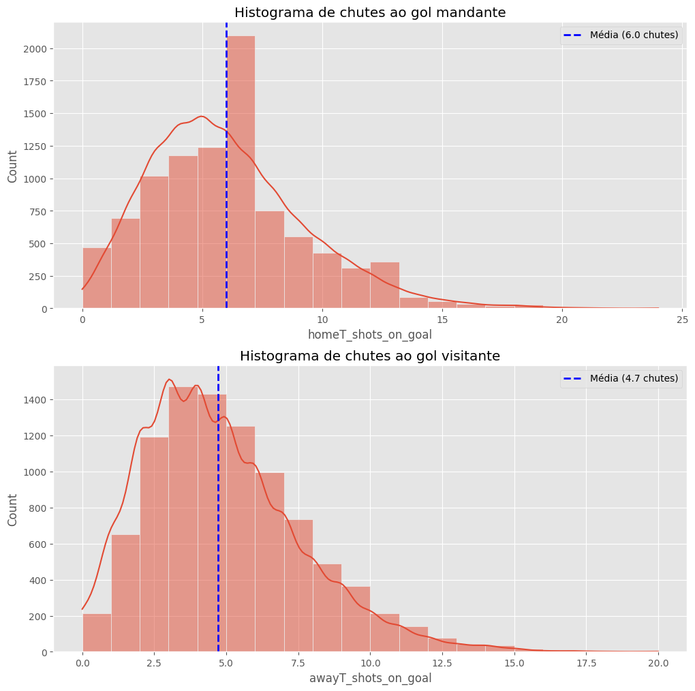
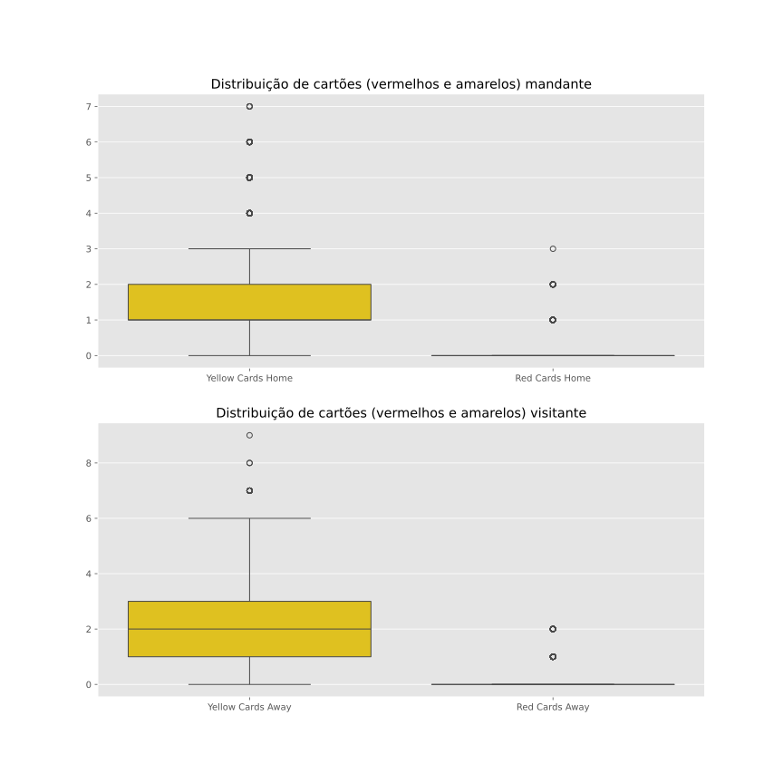
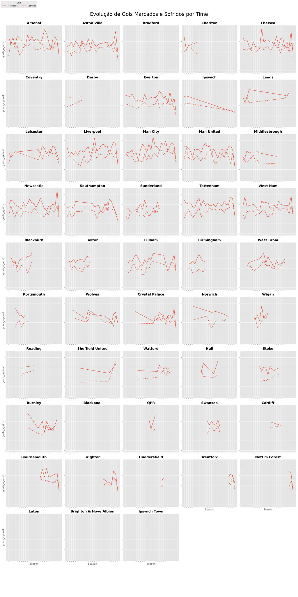
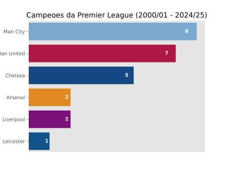
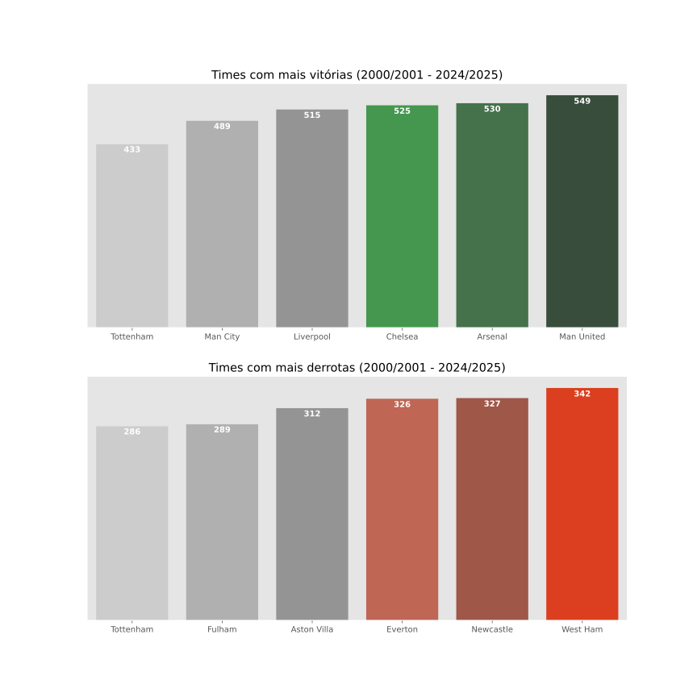

# Premier League Data Analysis

Este repositório contém uma análise exploratória de dados (EDA) de partidas da Premier League inglesa. A análise foi realizada em um Jupyter Notebook (`premier_league_analysys.ipynb`) e gera diversos gráficos que ilustram padrões de gols, finalizações, disciplina e desempenho de equipes ao longo das temporadas.

## 📝 Requisitos

- Python 3.8 ou superior  
- Jupyter Notebook  
- Dependências (listar em `requirements.txt`):
  ```
  pandas
  numpy
  matplotlib
  seaborn
  ```
  
Para instalar todas de uma vez:
```bash
pip install -r requirements.txt
```

## 🚀 Como executar

1. Clone este repositório.  
2. Coloque o arquivo de dados (`England CSV.csv`) no mesmo diretório do notebook.  
3. Abra o notebook:
   ```bash
   jupyter notebook premier_league_analysys.ipynb
   ```
4. Execute todas as células em ordem.  
5. Os gráficos serão salvos automaticamente no diretório de trabalho com os seguintes nomes:
   - `boxplots_gols.svg`  
   - `histogram_gols.svg`  
   - `boxplots_cartoes.svg`  
   - `off_def_ration.svg`  
   - `champs_epl.svg`  
   - `wins_and_losses.svg`  

## 📊 Principais Insights

### 1. Distribuição de Gols por Mandante e Visitante  
O boxplot abaixo mostra a distribuição de gols marcados pelo mandante versus visitante. Observa-se uma vantagem clara para o mandante, cuja mediana de gols é consistentemente mais alta.  


---

### 2. Finalizações ao Gol  
O histograma a seguir ilustra a frequência de finalizações no alvo (`shots on target`) para mandantes e visitantes. O time da casa mantém média superior, reforçando o fator mando de campo como vantagem ofensiva.  



---

### 3. Distribuição de Cartões  
Analisando cartões amarelos e vermelhos, percebe-se que os visitantes recebem ligeiramente mais cartões, possivelmente devido à postura mais defensiva ou falta de familiaridade com o estádio adversário. 



---

### 4. Evolução de Gols Marcados vs Sofridos  
Neste gráfico de razão ofensiva/defensiva, observamos como cada equipe evoluiu ao longo das temporadas em termos de gols marcados e sofridos. Alguns clubes exibem tendência de crescimento constante no ataque, enquanto outros apresentam oscilações defensivas.  



---

### 5. Distribuição de Títulos da Premier League  
Entre as temporadas 2000/01 e 2024/25, Manchester City lidera no número de troféus, seguido por Manchester United, Chelsea, Arsenal, Liverpool e Leicester.  



---

### 6. Vitórias e Derrotas Acumuladas  
O gráfico abaixo mostra o total de vitórias versus derrotas por clube. Manchester City e Manchester United aparecem no topo das vitórias, enquanto equipes como West Ham, Everton e Newcastle concentram mais derrotas.



---

## 🎯 Conclusão

1. Apesar das estatísticas semelhantes, em muitas vezes, divergindo em décimos, os times mandantes na English Premier League obtém superiodade em partidas ganhas, ganhando 45% das vezes. Essa tendência pode vir a explicar fatores comportamentais como influência da torcida, tipo de gramado e a familiaridade dos jogadores com o mesmo e outros indicadores.
2. Os times mandantes e visitantes possuem similaridade em quantidade de gols por partida (em média 1.53 e 1.17), já em cartões amarelos, times visitantes tendem a receber pelo menos 1 cartão amarelo a mais, não havendo significativa diferença entre a quantidade de cartões vermelhos e amarelos dados aos diferentes grupos de times.
3. O time mais vezes campeão da Premier League foi o Manchester City. Um ponto interessante é que a primeira vitória do time durante período analisado foi na temporada 2011/12 e, desde então, o time ganhou mais de 50% dos campeonatos disputados. Um fator importante foram as contrações cruciais e essenciais para o time, que contribuiram não só para títulos, mas para um aumento de 60% na taxa de vitória do time nas temporadas.
4. Apesar de ter mais campeonatos ganhos o Manchester City não é o time mais vitorioso dentro do período analisado. Esta posição é ocupada pelo rival e time da mesma cidade Manchester United (segundo colocado em campeonatos ganhos) que desde da temporada 2010/11 não é campeão e vem enfrentando períodos de instabilidade, evidenciados pela sua eficiência ofensiva/defensiva.

Esta análise explora características fundamentais das partidas da Premier League: vantagem de campo, padrões de finalização, disciplina e performance histórica de títulos e resultados. Sinta-se à vontade para estender o estudo, adicionar novas métricas ou comparar com outras ligas.
